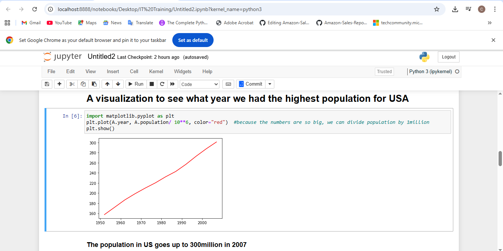
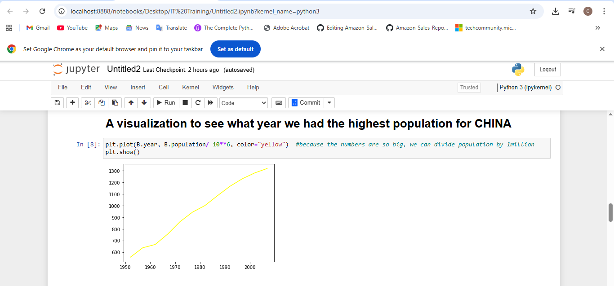
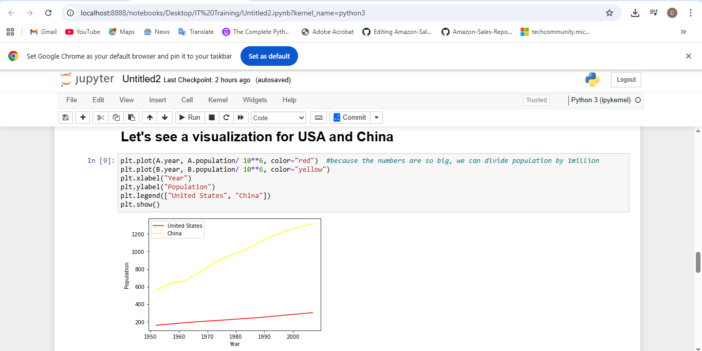

# Population-Growth-Analysis

---

## Introduction
This is my second project, a simple visualization to examine the population growth of the USA and China. The goal of this analysis is to understand how both countries have evolved demographically over time and what trends can be observed from their growth patterns. Using Python, I analyzed the dataset and created visual representations to compare and interpret their population changes. Through this project, I strengthened my data analysis and visualization skills, taking another step forward in my learning journey as I continue to explore the fields of data science and machine learning.

**_Disclaimer_** : _This dataset was obtained from Kaggle and is used strictly for educational and learning purposes. I do not claim ownership or rights to the data. All credit goes to the original data owner or creator._

## Problem Statement
The main objective of this project is to analyze and visualize the population growth patterns of the United States and China over time. By comparing both datasets, this analysis aims to:
1. Identify which country has consistently maintained a higher population.
2. Examine how population growth has evolved from 1952 to recent years.
3. Calculate and interpret the percentage growth in the base year (1952) for both countries.
4. Provide clear, visual insights that highlight long-term demographic trends using Python-based data analysis and matplotlib for visualization.

## Skills and Concepts Demonstrated
The following Python skills and data analysis concepts were applied in this project:
1. Data Cleaning and Preprocessing using pandas; loading the dataset, filtering data by country, and formatting columns.
2. Exploratory Data Analysis (EDA) through pandas to compare population trends between the USA and China.
3. Data visualization using Matplotlib to display population growth patterns over the years.
4. Percentage Growth Calculation to measure and compare the rate of population increase in the base year (1952).
5. Analytical Reasoning to interpret trends and derive meaningful insights from the data.

## Data Sourcing
The dataset used for this project was obtained from Kaggle in the form of a CSV file. 
It contains population records for multiple countries across different years, including China and the United States of America (USA).
This dataset served as the foundation for comparing the growth patterns between both countries.

The original dataset contained 1704 rows and 3 columns
---

### Analysis and Visualization
You can view the full analysis and visualization in the python file above.

---

A line plot visualization was used to display the population trend in the United States of America (USA) over time.
From the chart, it is evident that the highest population was recorded in 2007, reaching 300 million.

---

A line plot visualization was used to display the population trend in China over time.
From the chart, it is evident that the highest population was recorded in 2007, surpassing 1.3 billion.

---

The visualization displays the population growth trends of both the USA and China on a single plot. The red line represents the USA, while the yellow line represents China. From the chart, it is evident that China started with a significantly higher population in 1952 and has maintained a steady upward growth over the years.

---

This plot illustrates the percentage of population growth in the base year, 1952. The population of both the USA and China in 1952 was calculated and then expressed as a percentage of the total combined population of both countries for that year. This helps to show each country’s proportional share of the global population between the two at the start of the observation period.

## Conclusions and Recommendations
In conclusion, the analysis shows that in the base year 1952, the USA’s population grew by approximately 90%, while China’s population recorded a growth of over 120%. This indicates that China experienced a faster population expansion compared to the USA during that period, setting the foundation for the widening population gap observed in the years that followed.

Recommendation:
Based on the analysis, it is recommended that:
- Further studies should explore the factors driving China’s rapid population growth compared to the USA, such as birth rates, policies, and economic conditions.
- Additional datasets covering education, employment, and urbanization could be analyzed to understand how population growth impacts development.
- Visualizing population projections for future years can help predict trends and support policy planning.

Thank you for following through.😊
